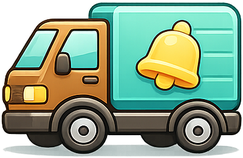
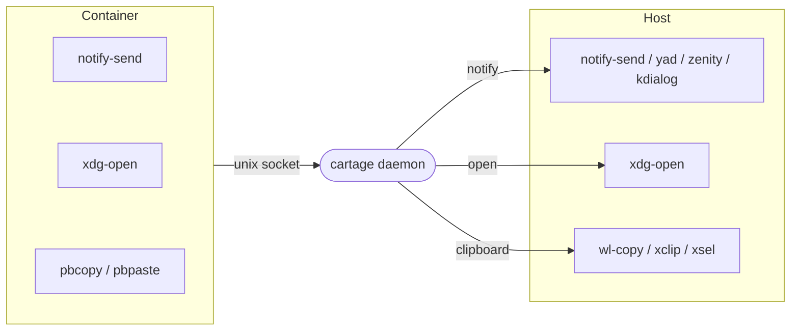

<p align="center">
  
</p>

# Cartage

Container-to-host bridge daemon. Routes intents (notifications, `xdg-open`, and more) from containers to the host desktop over a single Unix domain socket.

One socket. One daemon. One binary.

## How it works



Cartage runs as a daemon on the host, listening on a Unix socket. Inside containers, the same binary acts as a drop-in replacement for common desktop tools (`notify-send`, `xdg-open`, `pbcopy`, etc.). It detects which command it was invoked as (via `argv[0]`), translates the CLI arguments into an internal JSON protocol, and sends them to the daemon over the socket.

## Install

Download the latest release from [GitHub Releases](https://github.com/fgrehm/cartage/releases):

```sh
arch="$(uname -m)"
case "$arch" in
  x86_64)  arch="amd64" ;;
  aarch64|arm64) arch="arm64" ;;
  *) echo "Unsupported architecture: $arch" >&2; exit 1 ;;
esac
curl -fsSL "https://github.com/fgrehm/cartage/releases/latest/download/cartage_linux_${arch}.tar.gz" | \
  tar xz -C ~/.local/bin cartage
```

Or build from source:

```sh
make build
make install  # copies to ~/.local/bin
```

## Usage

### Start the daemon

```sh
cartage serve
```

The daemon listens on `$XDG_RUNTIME_DIR/cartage.sock` by default.

Options:
- `--socket`, `-s` -- override socket path
- `--verbose`, `-v` -- enable debug logging

For persistent use, create a systemd user service:

```ini
[Unit]
Description=Container-to-host bridge daemon
After=graphical-session.target
PartOf=graphical-session.target

[Service]
Type=simple
ExecStart=%h/.local/bin/cartage serve
Restart=on-failure
RestartSec=10

[Install]
WantedBy=graphical-session.target
```

> **Note:** `WantedBy=graphical-session.target` ensures the service starts after your desktop session is
> up and inherits `WAYLAND_DISPLAY`/`DISPLAY`/`DBUS_SESSION_BUS_ADDRESS` from it. Modern GNOME and KDE
> export these automatically. If notifications or `xdg-open` fail with "could not connect to display",
> add this to your session startup (e.g. `~/.profile` or your DE's autostart):
>
> ```sh
> systemctl --user import-environment WAYLAND_DISPLAY DISPLAY DBUS_SESSION_BUS_ADDRESS
> ```

### Send a notification

```sh
cartage notify "Build Complete"
cartage notify "Build Complete" "All tests passed"
cartage notify --alert "Error" "Build failed"
cartage notify --confirm "Continue?" "Deploy to production?"
```

### Open a URI

```sh
cartage open https://example.com
cartage open /path/to/file.pdf
```

### Clipboard

Copy text or images to/from the host clipboard.

```sh
# Copy text
echo "hello from container" | cartage clipboard copy
cartage clipboard copy "hello world"

# Copy an image
cartage clipboard copy --image screenshot.png

# Paste text
cartage clipboard paste

# Paste image to file
cartage clipboard paste --output /tmp/pasted.png
```

### Container setup

Mount the socket and binary into your container:

```yaml
services:
  app:
    volumes:
      - ${XDG_RUNTIME_DIR}:/run/host:ro
      - ~/.local/bin/cartage:/usr/local/bin/cartage:ro
      # Symlink the tools you need
      - ~/.local/bin/cartage:/usr/local/bin/notify-send:ro
      - ~/.local/bin/cartage:/usr/local/bin/xdg-open:ro
      - ~/.local/bin/cartage:/usr/local/bin/pbcopy:ro
      - ~/.local/bin/cartage:/usr/local/bin/pbpaste:ro
```

Inside the container, `notify-send`, `xdg-open`, etc. work as expected, forwarding to the host.

If you need blocking dialogs (alerts, confirmations), add a symlink for your preferred dialog tool (`yad`, `zenity`, or `kdialog`):

```yaml
      - ~/.local/bin/cartage:/usr/local/bin/yad:ro
```

### Path mapping

When opening files from a container, the container path (e.g., `/workspace/file.pdf`) won't exist on the host. Set `CARTAGE_PATH_MAP` to translate container paths to host paths before they're sent to the daemon:

```
CARTAGE_PATH_MAP=<container_prefix>:<host_prefix>[,<container_prefix>:<host_prefix>,...]
```

Only file paths (starting with `/`) are rewritten. URLs pass through unchanged. When multiple mappings match, the longest (most specific) prefix wins.

```yaml
services:
  app:
    environment:
      - CARTAGE_PATH_MAP=/workspace:/home/user/projects/oss
    volumes:
      - ~/projects/oss:/workspace
      - ${XDG_RUNTIME_DIR}:/run/host:ro
      - ~/.local/bin/cartage:/usr/local/bin/xdg-open:ro
```

With this configuration, `xdg-open /workspace/my-project/file.pdf` inside the container opens `~/projects/oss/my-project/file.pdf` on the host.

### Multicall binary

Cartage behaves differently based on how it's invoked:

| `argv[0]` | Behavior |
|---|---|
| `cartage` | CLI with subcommands (serve, notify, open, clipboard, version) |
| `notify-send` | notify-send compatible client |
| `xdg-open` | xdg-open compatible client |
| `pbcopy` | macOS pbcopy compatible client (stdin → clipboard) |
| `pbpaste` | macOS pbpaste compatible client (clipboard → stdout) |
| `yad` | yad compatible client (dialogs) |
| `zenity` | zenity compatible client (dialogs) |
| `kdialog` | kdialog compatible client (dialogs) |

Create symlinks or bind-mount the binary under the names you need.

## Protocol

Newline-delimited JSON over Unix socket.

**Request:**
```json
{
  "version": 1,
  "action": "notify",
  "payload": { "title": "Hello", "mode": "toast" }
}
```

**Response:**
```json
{
  "status": "ok",
  "data": { "id": "uuid-here" }
}
```

Actions: `notify` (toast, alert, confirm), `open` (xdg-open forwarding), `clipboard` (read/write text and images).

## Socket discovery

The client checks these locations in order:

1. `$CARTAGE_SOCKET` (explicit override)
2. `$XDG_RUNTIME_DIR/cartage.sock` (host)
3. `/run/host/cartage.sock` (container)
4. `/tmp/cartage.sock` (fallback)

## Development

```sh
make test       # run tests
make lint       # run golangci-lint
make build      # build to dist/cartage
make coverage   # generate coverage report
```

## Prior art

- [vagrant-notify](https://github.com/fgrehm/vagrant-notify) - Vagrant plugin that forwarded `notify-send` from guest VMs to the host (2013)
- [notify-send-http](https://github.com/fgrehm/notify-send-http) - HTTP-based notification forwarding for containers (2016)
- [desk-notify](https://github.com/fgrehm/desk-notify) - Unix socket notification bridge for containers (2025)

Cartage generalizes these into a multi-action bridge, adding `xdg-open` forwarding, clipboard access, multicall binary compatibility, and a protocol designed for further extension.

## Acknowledgments

Built with [Claude Code](https://claude.ai/code) (Opus 4.6, Sonnet 4.6, Haiku 4.5).

## License

[MIT](LICENSE)
