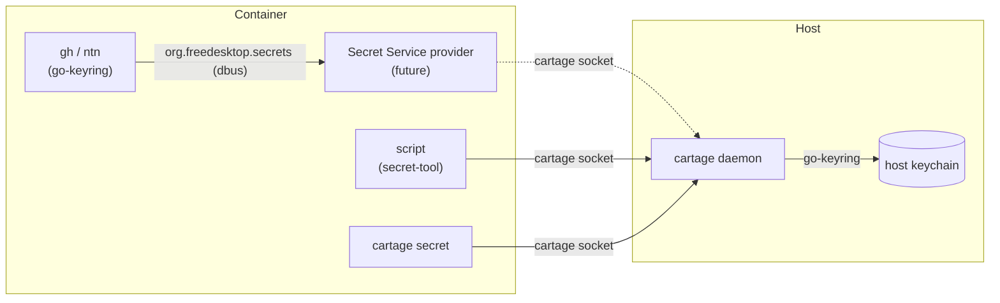
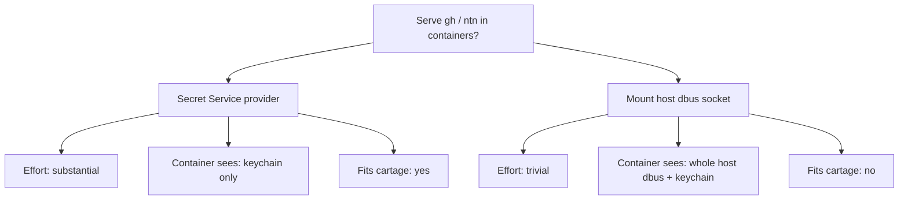

# Keychain Support Spec

## Status

- **In progress.** The `secret` action (`get`/`set`/`list`) and the `secret-tool`
  compat alias are implemented. The Secret Service provider (the feature that
  actually serves `gh`/`ntn`) is **not started** and has an open design decision.

## Context

Cartage is a container-to-host bridge daemon. Containers frequently need secrets
(API tokens, DB passwords, registry credentials) but should not have them baked
into images. The goal is to let containers read and write secrets in the host's
OS keychain (Secret Service / libsecret on Linux, Keychain on macOS, Credential
Manager on Windows) over the existing Unix socket.

Backend: `github.com/zalando/go-keyring`, the standard cross-platform Go keychain
wrapper. On Linux it talks to the Secret Service over dbus, so it works with a
statically linked binary and no cgo.

## Goals

- Provide a `secret` action so containers can `get`/`set`/`list` host keychain
  entries over the cartage socket.
- Provide a `cartage secret` CLI for interactive use.
- Provide a `secret-tool` multicall alias for scripts that call `secret-tool`.
- **Long-term:** make go-keyring-based CLIs (`gh`, `ntn`, etc.) work in
  containers by exposing a Secret Service dbus provider that forwards to the
  host keychain.

## Non-goals

- Storing secrets inside the container image or on the container filesystem.
- Replacing the host's keychain; cartage only bridges to it.
- Full libsecret feature parity (e.g. collections, sessions, locking) unless the
  provider work requires it.

## Key insight: why `secret-tool` is not enough

`gh` and `ntn` store credentials via `github.com/zalando/go-keyring` — the same
library cartage uses. On Linux, go-keyring talks to the **Secret Service dbus
interface** (`org.freedesktop.secrets`) directly; it never invokes `secret-tool`.
So in a container without a Secret Service provider, `gh` falls back to plaintext
in `~/.config/gh/hosts.yml`.

Consequence: the `secret-tool` alias only helps scripts that literally call
`secret-tool`. It does **not** help `gh`/`ntn`. Serving those tools requires a
Secret Service dbus provider (see "Open decision" below).

## Architecture



Three front-ends funnel into the single `secret` action:

- **`cartage secret` CLI** and the **`secret-tool` alias** (solid lines) work today,
  sending requests straight to the daemon over the socket.
- **`gh`/`ntn`** (dashed line) talk to `org.freedesktop.secrets` over dbus and
  need the **Secret Service provider** — not yet built — to reach the daemon.

This is why the `secret-tool` alias alone does not serve `gh`/`ntn`: they never
call the binary; they speak dbus to the provider.

## Protocol

Action name: `secret`. Ops: `get`, `set`, `list`.

**Request payload:**

```json
{ "op": "get",  "service": "myapp", "user": "alice" }
{ "op": "set",  "service": "myapp", "user": "alice", "secret": "hunter2" }
{ "op": "list" }
```

**Response data:**

```json
{ "secret": "hunter2" }                                  // get
{ "secrets": [ { "service": "myapp", "user": "alice" } ] } // list
```

`get`/`set` are cross-platform (go-keyring). `list` queries the Secret Service
dbus interface directly (go-keyring has no List API) and is Linux-only; it
returns a clear error elsewhere.

## Components

### Handler (`internal/secret/`)

- `handler.go`: `Handler` with `Action() = "secret"`; `get`/`set` via
  `keyring.Get`/`keyring.Set`, `list` via `listSecrets()`. Validates required
  fields and returns `protocol.ErrorResponse` on failure.
- `list.go`: `listSecrets()` queries `org.freedesktop.secrets` over dbus; guards
  on `runtime.GOOS` and returns a clear error on non-Linux.
- Tests use `keyring.MockInit()` for hermetic coverage; the real-keychain
  round-trip test skips when the keychain is unreachable (keeps CI green).

### CLI (`cli/secret.go`)

- `cartage secret get SERVICE USER` — prints the secret.
- `cartage secret set SERVICE USER [SECRET]` — reads from stdin when omitted.
- `cartage secret list` — prints `service<TAB>user` per line.

### Compat alias (`internal/compat/secrettool.go`)

- `secret-tool store` → `secret set` (secret read from stdin).
- `secret-tool lookup` → `secret get` (secret printed to stdout).
- `secret-tool clear`/`search` → clear "not supported" error.
- Registered in `GetCompatMode` and dispatched in `cmd/cartage/main.go`.

### Secret Service provider (future)

A dbus service implementing `org.freedesktop.secrets` that runs on a
container-local session bus and forwards to the host keychain over the cartage
socket. This is what go-keyring apps (`gh`, `ntn`) actually need. Not yet built.

## Security considerations

- The `secret` action exposes only the keychain operations cartage implements.
- The `secret-tool` alias is a narrow CLI translation; it adds no host access.
- A Secret Service provider must run on a **container-local** dbus bus and
  forward over the narrow cartage socket, so the container never gains access to
  the host's dbus session bus.

## Open decision: Secret Service provider vs. mounting the host socket

Serving `gh`/`ntn` requires either:



1. **A Secret Service dbus provider** (cartage-consistent). Substantial effort:
   implement `OpenSession`, `CreateCollection`/`ReadAlias`, `SearchItems`,
   `CreateItem`, `GetSecret`, `Delete`, `Unlock`. Container sees only the
   keychain, only what cartage allows.
2. **Mount the host dbus session bus** into the container (volume + env var).
   Trivial, but hands the container the entire host dbus and the whole keychain —
   the security boundary cartage exists to provide.

**Recommendation:** Option 1 if the security boundary matters; Option 2 if the
containers are trusted dev environments. This decision gates the provider work.

## Phased plan

### Phase 0: Tracer bullet — DONE

Real keychain round-trip test (`keyring.Set` → `keyring.Get` → assert → delete),
skipping when the keychain is unreachable. Passed against the real keychain,
validating that go-keyring works in the daemon's environment.

### Phase 1: Handler — DONE

`internal/secret/handler.go` with `get`; `MockInit()` unit tests.
Commit: `feat(secret): add secret get handler`

### Phase 2: CLI — DONE

`cartage secret get SERVICE USER`.
Commit: `feat(secret): add secret get CLI command`

### Phase 3: Wire up and document — DONE

Register handler in `serve.go`; README + CHANGELOG.
Commit: `docs(secret): register handler and document secret get`

### Phase 4: List — DONE

`listSecrets()` via dbus; `OpList`, `ListResult`; `cartage secret list`.
Commit: `feat(secret): add secret list command`

### Phase 5: Set — DONE

`OpSet`, `handleSet`; `cartage secret set SERVICE USER [SECRET]`.
Commit: `feat(secret): add secret set command`

### Phase 6: secret-tool compat — BUILT, UNCOMMITTED

`HandleSecretTool` maps `store`/`lookup`; `clear`/`search` error.
Commit: `feat(compat): add secret-tool multicall mode`

### Phase 7: Secret Service provider — NOT STARTED

Depends on the open decision above. If approved, this is a new tracer-bullet
plan: prove a minimal `org.freedesktop.secrets` implementation can satisfy
go-keyring's `Set`/`Get`/`Delete` calls end-to-end, then grow it.

## Progress

- [x] Phase 0: Tracer bullet (real keychain round-trip)
- [x] Phase 1: Handler
- [x] Phase 2: CLI
- [x] Phase 3: Wire up and document
- [x] Phase 4: List
- [x] Phase 5: Set
- [x] Phase 6: secret-tool compat (built, uncommitted)
- [ ] Phase 7: Secret Service provider (blocked on open decision)
